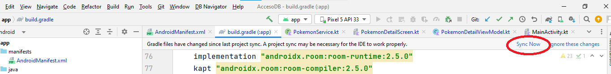

# Título 1 
## Indice
- [Configuración del Ambiente de Desarrollo](#configuración-del-ambiente-de-desarrollo)
    - [Instalación de Node JS](#instalacion-de-nodejs)
    - [Ir a Fuentes](#fuentes)
- [Ir a Fuentes](#fuentes)

### <center>Título 3</center>
---

## Configuración de la herramienta Flutter

### <b>Para Windows</b>

1. Requerimientos mínimos
    - Windows 10 o posterior (64 bits), basado en x86-64.
    - Espacio en disco: 1,64 GB
    - Windows PowerShell 5.0 (default)
    - Git para Windows 2.x 
2. Obtener el SDK de Flutter
    - Descargar haciendo clic [aquí](https://storage.googleapis.com/flutter_infra_release/releases/stable/windows/flutter_windows_3.10.5-stable.zip).

        <i>Nota</i>: Para versiones anteriores del SDK, clic [aquí](https://docs.flutter.dev/release/archive).
3. Extraer el zip en la ruta que se elija.

4. Actualizar el <b>path</b>
    - Ir a "Editar variables de entorno para su cuenta" en la barra de búsqueda de Inicio
    - En Variables de usuario, comprueba si hay una entrada llamada Path:
        - Si la entrada existe, añada la ruta completa a flutter\bin utilizando ; como separador de los valores existentes.
        - Si la entrada no existe, cree una nueva variable de usuario llamada Path con la ruta completa a flutter\bin como valor.
        - Cerrar y volver a abrir cualquier consola para que se guarden los cambios.

5. Ejecutar <i style="color:#2F98A4">flutter doctor</i>

        C:\src\flutter>flutter doctor

    - Instalar los software que falten u otras tareas que se indiquen en los resultados de la ejecución del comando.

### <b>Para Mac</b>
1. Requerimientos mínimos
    - Sistema Operativo macOS, versión 10.14 (Mojave) o posterior
    - Espacio en disco: 2,08 GB
    - Flutter utiliza git para la instalación y actualización.
2. Obtener el SDK de Flutter
    - Para procesadores Intel: clic [aquí](https://storage.googleapis.com/flutter_infra_release/releases/stable/macos/flutter_macos_3.10.5-stable.zip).
    - Para procesadores basados en la arquitectura ARM de Apple Silicon (nuestro caso, procesador M1): clic [aquí](https://storage.googleapis.com/flutter_infra_release/releases/stable/macos/flutter_macos_arm64_3.10.5-stable.zip).

3. Extraer el zip en la ruta que se elija.

        $ unzip ~/Downloads/flutter_macos_3.10.5-stable.zip


4. Añadir la herramienta Flutter al <b>path</b>

        $ export PATH="$PATH:`pwd`/flutter/bin"

5. Ejecutar <i style="color:#2F98A4">flutter doctor</i>

        flutter doctor 

    - Instalar los software que falten u otras tareas que se indiquen en los resultados de la ejecución del comando.


## Configurar Ambiente de Desarrollo o IDE (Visual Studio Code)

### <b>Añadir extensión</b>
En la sección de <i>Extensions</i> (Ctrl + Shift + X), buscar e instalar:
- "Flutter" de [DartCode.org](https://dartcode.org/) 
- "Dart" de [DartCode.org](https://dartcode.org/) <i>(usualmente se instala junto con Flutter)</i>

### <b>Crear proyecto en VS Code</b>
<p>
</p>

#### <b>Para Windows</b>

1. Buscar archivo o Ctrl + P:

        > Flutter: New Project
    
    

2. Crear aplicación con Flutter:

    

3. Seleccionar la carpeta en la que se guardará el proyecto y crear nombre. El nombre del proyecto debe ir en minúsculas y separado por guiones bajos en caso fuera necesario.

    

#### <b>Para Mac</b>

1. En la consola de VS Code o en la terminal:

        > cd <ruta_donde_se_va_a_crear_el_proyecto> 
        > flutter create <nombre_de_app> 

## Conexión a un servidor web

Primero hay que instalar las dependencias en el archivo <b>build.gradle</b>:

```gradle
dependencies {
    ...
    // retrofit
    implementation "com.squareup.retrofit2:retrofit:2.9.0"
    implementation "com.squareup.retrofit2:converter-gson:2.9.0"
    implementation 'com.squareup.okhttp3:okhttp:4.9.1'
    implementation 'com.squareup.okhttp3:logging-interceptor:4.9.1'
    ...
}
```

Sincronizamos las dependencias:



Crear un arhivo backcliente:

```kotlin
    const val BASE_URL = "https://programamovilv2.jose-jesusjes13.repl.co/"
    //const val BASE_URL ="http://192.168.1.27:8000/"
    private val retrofit: Retrofit by lazy {
        Retrofit.Builder()
            .baseUrl(BASE_URL)
            .addConverterFactory(GsonConverterFactory.create())
            .build()
    }

    val pokemonService: PokemonService by lazy {
        retrofit.create(PokemonService::class.java)
    }

    fun <T> buildService(service: Class<T>): T{
        return retrofit.create(service)
    }
}
```
## Diagrama de despliegue
$~$

## Requerimientos no funcionales

 **1. Usabilidad:**
- La interfaz de usuario debe ser intuitiva y fácil de usar para usuarios no técnicos.
- Los tiempos de carga de la aplicación deben ser rápidos, para minimizar la espera del usuario.
- La aplicación debe ser compatible con una amplia gama de dispositivos móviles y tamaños de pantalla.

**2. Rendimiento:**
- Los tiempos de respuesta de la aplicación deben ser consistentes incluso bajo cargas de trabajo pesadas.
- La aplicación debe optimizarse para minimizar el consumo de recursos (CPU, memoria, batería) en el dispositivo móvil.
    
**3. Seguridad:**
- Los datos personales de los usuarios deben ser almacenados y transmitidos de manera segura, utilizando técnicas de encriptación adecuadas.
 - La aplicación debe implementar medidas de autenticación y autorización para garantizar el acceso seguro a las funciones y datos.
- Se debe realizar una validación adecuada de los datos de entrada para prevenir ataques como inyecciones de código o ataques de denegación de servicio.
  
**4. Escalabilidad:**
- La aplicación debe ser capaz de manejar un aumento en el número de usuarios y transacciones sin degradar su rendimiento.
- Debe ser posible agregar nuevos servicios o funcionalidades a la aplicación sin afectar negativamente su rendimiento o disponibilidad.
  
**5. Fiabilidad:**
- La aplicación debe ser estable y no debe bloquearse o cerrarse inesperadamente.
- La aplicación debe tener mecanismos de recuperación ante fallas, de modo que pueda continuar funcionando correctamente después de una interrupción.

$~$
---
### Fuentes:
+ https://ionicframework.com/docs/intro/cli
+ https://nodejs.org/es/download