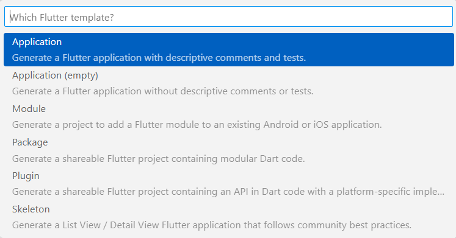

# Título 1 
## Indice
- [Configuración de la herramienta Flutter](#configuración-de-la-herramienta-flutter)
    - [Para Windows](#para-windows)
    - [Para Mac](#para-mac)
- [Configurar Ambiente de Desarrollo o IDE (Visual Studio Code)](#configurar-ambiente-de-desarrollo-o-ide-visual-studio-code)
    - [Añadir extensión](#añadir-extensión)
    - [Crear proyecto en VS Code](#crear-proyecto-en-vs-code)
        - [Para Windows](#para-windows-1)
        - [Para Mac](#para-mac-1)
- [Instalación de Dependencias y conexión al servidor](#instalación-de-dependencias-y-conexión-a-servidor)
- [Ir a Fuentes](#fuentes)


---

## Configuración de la herramienta Flutter

### <b>Para Windows</b>

1. Requerimientos mínimos
    - Windows 10 o posterior (64 bits), basado en x86-64.
    - Espacio en disco: 1,64 GB
    - Windows PowerShell 5.0 (default)
    - Git para Windows 2.x 
2. Obtener el SDK de Flutter
    - Descargar haciendo clic [aquí](https://storage.googleapis.com/flutter_infra_release/releases/stable/windows/flutter_windows_3.10.5-stable.zip).

        <i>Nota</i>: Para versiones anteriores del SDK, clic [aquí](https://docs.flutter.dev/release/archive).
3. Extraer el zip en la ruta que se elija.

4. Actualizar el <b>path</b>
    - Ir a "Editar variables de entorno para su cuenta" en la barra de búsqueda de Inicio
    - En Variables de usuario, comprueba si hay una entrada llamada Path:
        - Si la entrada existe, añada la ruta completa a flutter\bin utilizando ; como separador de los valores existentes.
        - Si la entrada no existe, cree una nueva variable de usuario llamada Path con la ruta completa a flutter\bin como valor.
        - Cerrar y volver a abrir cualquier consola para que se guarden los cambios.

5. Ejecutar <i style="color:#2F98A4">flutter doctor</i>

        C:\src\flutter>flutter doctor

    - Instalar los software que falten u otras tareas que se indiquen en los resultados de la ejecución del comando.

### <b>Para Mac</b>
1. Requerimientos mínimos
    - Sistema Operativo macOS, versión 10.14 (Mojave) o posterior
    - Espacio en disco: 2,08 GB
    - Flutter utiliza git para la instalación y actualización.
2. Obtener el SDK de Flutter
    - Para procesadores Intel: clic [aquí](https://storage.googleapis.com/flutter_infra_release/releases/stable/macos/flutter_macos_3.10.5-stable.zip).
    - Para procesadores basados en la arquitectura ARM de Apple Silicon (nuestro caso, procesador M1): clic [aquí](https://storage.googleapis.com/flutter_infra_release/releases/stable/macos/flutter_macos_arm64_3.10.5-stable.zip).

3. Extraer el zip en la ruta que se elija.

        $ unzip ~/Downloads/flutter_macos_3.10.5-stable.zip


4. Añadir la herramienta Flutter al <b>path</b>

        $ export PATH="$PATH:`pwd`/flutter/bin"

5. Ejecutar <i style="color:#2F98A4">flutter doctor</i>

        flutter doctor 

    - Instalar los software que falten u otras tareas que se indiquen en los resultados de la ejecución del comando.


## Configurar Ambiente de Desarrollo o IDE (Visual Studio Code)

### <b>Añadir extensión</b>
En la sección de <i>Extensions</i> (Ctrl + Shift + X), buscar e instalar:
- "Flutter" de [DartCode.org](https://dartcode.org/) 
- "Dart" de [DartCode.org](https://dartcode.org/) <i>(usualmente se instala junto con Flutter)</i>

### <b>Crear proyecto en VS Code</b>
<p>
</p>

#### <b>Para Windows</b>

1. Buscar archivo o Ctrl + P:

        > Flutter: New Project
    
    

2. Crear aplicación con Flutter:

    

3. Seleccionar la carpeta en la que se guardará el proyecto y crear nombre. El nombre del proyecto debe ir en minúsculas y separado por guiones bajos en caso fuera necesario.

    

#### <b>Para Mac</b>

1. En la consola de VS Code o en la terminal:

        > cd <ruta_donde_se_va_a_crear_el_proyecto> 
        > flutter create <nombre_de_app> 

## Instalación de dependencias y conexión a servidor

Para la conexión al servidor, se usará el mismo backend que se utilizó para la entrega anterior. Las dependencias se colocan en el archivo <b>pubspec.yaml</b>:
```yaml
 dependencies:
  flutter:
    sdk: flutter
  http: ^0.13.3
```

Luego de colocarlas, se instalan a través de la terminal con el comando:

        > flutter pub get


Para usarlas en un archivo dart, colocar esta línea:

```dart
    import 'package:http/http.dart' as http;
```

## Firebase

### Instalación de Firebase
<p>

- Con Node JS instalado, ejecutar (tanto para Windows como para Mac):

        > npm install -g firebase-tools


Seguir los siguientes pasos:
1. Iniciar sesión en Firebase con cuenta de Google ([link](https://console.firebase.google.com/)).
2. En la consola de Firebase, crear un proyecto.
3. Agregar app para Flutter

    

4. En la nueva pantalla:
    - Preparar lugar de trabajo
        - Tener instalado el CLI de Firebase e iniciar sesión en la consola a través de:
            > firebase login
        - Tener instalado el SDK de Flutter
        - Tener un proyecto creado en Flutter
    - Instalar y ejecutar la CLI de FlutterFire
        - Ejecutar comando:
            > dart pub global activate flutterfire_cli
        - En la raíz del directorio del proyecto, ejecutar comando:
            > flutterfire configure --project=<nombre_proyecto>-debbe
        - Si no permite ejecutar ese último comando, ir a Inicio y buscar "Editar variables de entorno de esta cuenta" y agregar en PATH lo siguiente:
            > C:\Users\<usuario>\AppData\Local\Pub\Cache\bin
    - Inicializar Firebase:
        - En el archivo dart, importar:

        ```dart
        import 'package:firebase_core/firebase_core.dart';
        import 'firebase_options.dart';
        ```

        - Añadir el código:

        ```dart
        await Firebase.initializeApp(
            options: DefaultFirebaseOptions.currentPlatform,
        );
        ```
    
    - En caso salga error en la primera librería, ejecutar este comando en la raíz del directorio:

        > flutter pub add firebase_core

    <i>Eso debería resolver el problema</i>

    

---
### <b>Fuentes</b>:
+ SDK de Flutter: [link](https://docs.flutter.dev/get-started/install)
+ Referencia de Firebase CLI: [link](https://firebase.google.com/docs/cli?hl=es&authuser=0&_gl=1*1crcpgv*_ga*MTgyNDYwMjI3OC4xNjg2OTUzODQx*_ga_CW55HF8NVT*MTY4ODYxNDQ1OS40LjEuMTY4ODYxNTgxOC4wLjAuMA..#install_the_firebase_cli)

